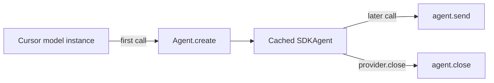
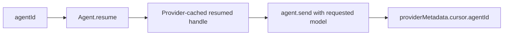

# Session management

Cursor agents, not AI SDK prompt transcripts, own conversation state. Reusing one model instance is
the recommended continuation pattern. Explicit `agentId` resume is appropriate only when the target
runtime/store can resolve that ID; injected `SDKAgent` and `createNewAgentPerCall` cover advanced and
stateless cases.

Live validation on 2026-07-15 confirmed that reusing the same model object preserves context and the
same `providerMetadata.cursor.agentId` in both plan and agent modes. Cross-instance resume against the
default local store failed with `agent_not_found` in that environment.

## Default: one agent per model instance



```ts
const model = cursor('composer-2.5', { local: { cwd: '/path/to/safe/workspace' } });

await generateText({ model, prompt: 'Remember issue 417.' });
const next = await generateText({ model, prompt: 'Which issue are we discussing?' });
```

The model accepts a fresh single user turn each time. Do not pass the earlier assistant/tool history
back unless you deliberately choose a lossy `promptHistoryMode`.

## Explicit resume by `agentId`



Read the ID from terminal provider metadata. Cloud IDs route to Cursor cloud. For local agents, an
ID is useful only when resume receives the same explicit persistence store and compatible workspace
routing that created it.

```ts
import { JsonlLocalAgentStore } from '@cursor/sdk';
import { generateText } from 'ai';
import { createCursor } from 'ai-sdk-provider-cursor-sdk';

const cwd = '/path/to/safe/workspace';
const storeDirectory = '/path/to/cursor-agent-store';
const providerA = createCursor();
const first = await generateText({
  model: providerA('composer-2.5', {
    local: { cwd, store: new JsonlLocalAgentStore(storeDirectory) },
  }),
  prompt: 'Create a checklist.',
});

const agentId = first.finalStep.providerMetadata?.cursor?.agentId;
if (typeof agentId !== 'string') throw new Error('No Cursor agent ID');
await providerA.close();

const providerB = createCursor();
const second = await generateText({
  model: providerB('composer-2.5', {
    agentId,
    sdkAgentOptions: {
      local: { cwd, store: new JsonlLocalAgentStore(storeDirectory) },
    },
  }),
  prompt: 'Continue the checklist.',
});
await providerB.close();
```

You can also construct a model with `{ agentId }`. Per-call `providerOptions.cursor.agentId` has the
highest precedence. Resumed handles are cached by ID inside a provider, so later calls on that model
reuse them. The local resume path receives `sdkAgentOptions`, not creation-time `settings.local`,
which is why the explicit store and `cwd` appear under `sdkAgentOptions.local` above.

Cursor auto-detects runtime from the ID: `bc-...` routes to cloud; other IDs route to the local
store. Do not present an ID alone as durable local persistence: the validated default-store
cross-instance pattern is not reliable.

## Fresh agent for every call


```ts
const model = cursor('composer-2.5', {
  createNewAgentPerCall: true,
  local: { cwd: '/path/to/safe/workspace' },
});
```

This is stateless from the model's perspective. Each call still creates a durable Cursor agent ID,
but the provider does not retain its handle after the call.

## Injected agents

```ts
import { Agent } from '@cursor/sdk';
import { createCursor } from 'ai-sdk-provider-cursor-sdk';

const agent = await Agent.create({
  apiKey: process.env.CURSOR_API_KEY,
  model: { id: 'composer-2.5' },
  local: { cwd: '/path/to/safe/workspace' },
});

const provider = createCursor();
const model = provider('composer-2.5', { agent });
```

Injected handles are caller-owned. Neither call cleanup nor `provider.close()` closes them. Close or
async-dispose the agent yourself.

## Acquisition precedence and ownership

| Source                                      | Precedence | Cache                            | Ownership             |
| ------------------------------------------- | ---------- | -------------------------------- | --------------------- |
| Call-level `providerOptions.cursor.agentId` | 1          | By agent ID                      | Provider-owned handle |
| Model `settings.agentId`                    | 2          | By agent ID                      | Provider-owned handle |
| Model `settings.agent`                      | 3          | Caller-provided object           | Caller-owned          |
| Model-instance cached agent                 | 4          | By model object                  | Provider-owned        |
| New agent                                   | 5          | Model cache unless per-call mode | Provider-owned        |

`agentId`, `agent`, and `createNewAgentPerCall: true` cannot be set together in model settings.

## Resume caveats

### MCP servers

Cursor does not persist inline `mcpServers` across `Agent.resume()`. The provider re-passes
`settings.mcpServers` every time it performs an explicit resume. Keep the same definitions available
to the resuming process, or use appropriate file/dashboard configuration.

The provider does not expose Cursor's per-send MCP replacement channel because it fully replaces,
rather than merges with, creation-time servers.

### Model selection

Cursor reports `agent.model` as undefined after a resume unless the caller supplies a model again.
Every provider send therefore includes `{ id: modelId, params: modelParams }`. This also avoids
accidentally inheriting a sticky model override from a previous run.

### Conversation mode

The provider sends a mode override only when a call-level `providerOptions.cursor.mode` or model
`settings.mode` explicitly configures one; the call-level value wins. Otherwise it omits `mode`, so
reused and resumed agents preserve their current conversation mode. Newly created agents still
start in the provider default `'agent'` mode.

### Local stores and working directories

Local resume must resolve the same persistence store/workspace that contains the agent. Model
`settings.local` is used during `Agent.create`; the explicit resume path passes auth, MCP servers,
subagents, and `sdkAgentOptions`. A cross-instance ID lookup through the default local store returned
`agent_not_found` during the 2026-07-15 live validation, so it is not a supported persistence example.

For deliberate local persistence, create with an explicit `JsonlLocalAgentStore`, then resume with a
new store object pointed at the same directory through `sdkAgentOptions.local`, as shown above. Keep
the `cwd` compatible as well. Portability across machines/process lifecycles remains environment
sensitive and should be live-smoked by the application.

### Custom tools

Creation-time `settings.customTools` / `settings.local.customTools` apply to newly created local
agents. If a resumed handle needs explicit local custom-tool options, pass them through
`sdkAgentOptions.local.customTools`. Cursor custom tools are not available for cloud agents.

### Stale IDs

An `AgentNotFoundError` is mapped to a non-retryable `APICallError` with
`data.code === 'agent_not_found'`. A cached handle whose resume, send, or wait operation throws that
error is evicted. Start a new session or correct the local store/workspace instead of blindly
retrying the same ID.

```ts
import { isStaleAgentError } from 'ai-sdk-provider-cursor-sdk';

try {
  await generateText({ model, prompt: 'Continue.' });
} catch (error) {
  if (isStaleAgentError(error)) {
    // Clear the saved ID and start a new model/session.
  } else {
    throw error;
  }
}
```

## Concurrency

The provider serializes sends per `agent.agentId`. Overlapping calls on one model or explicit agent
wait for the active call; distinct agents can run in parallel. A queued call aborted before its turn
throws the original abort reason without calling `agent.send()`.

This prevents unverified local checkpoint races and avoids ordinary same-provider cloud busy
conflicts. A cloud agent may still report `agent_busy` when another process owns the active run.

For a local agent left with a persisted active run after a process crash, use the one-call recovery
option:

```ts
providerOptions: { cursor: { agentId, localForce: true } }
```

This maps to `send({ local: { force: true } })`. Do not use it as a substitute for normal
serialization.

## Prompt history modes

| Mode      | Behavior                                             | Warning/error                      |
| --------- | ---------------------------------------------------- | ---------------------------------- |
| `reject`  | Reject assistant/tool history or multiple user turns | `UnsupportedFunctionalityError`    |
| `ignore`  | Send only the latest user turn                       | `other` warning                    |
| `flatten` | Serialize history into one user message              | compatibility/unsupported warnings |

Resuming/reusing a session does not change the mode automatically. The safe default continuation
pattern is a new single-user-turn prompt to the same model object. Use an agent ID only when cloud or
an explicitly configured local store can resolve it.

## Provider metadata

The terminal `cursor` metadata object is JSON-safe:

| Field         | Type                                   | Source                               |
| ------------- | -------------------------------------- | ------------------------------------ |
| `agentId`     | `string`                               | Live run/agent                       |
| `runId`       | `string`                               | `RunResult.id`                       |
| `requestId`   | `string?`                              | Cursor platform correlation ID       |
| `model`       | `string?`                              | Resolved terminal model              |
| `modelParams` | `{ id; value }[]?`                     | Resolved model parameters            |
| `status`      | `'finished' \| 'error' \| 'cancelled'` | Run result                           |
| `durationMs`  | `number?`                              | Run result                           |
| `result`      | `string?`                              | Terminal assistant text              |
| `usage`       | `TokenUsage?`                          | Terminal or turn-summed Cursor usage |
| `git`         | branch/PR object                       | Cloud run result, when supplied      |

With `generateText`, use `result.finalStep.providerMetadata?.cursor`. With `streamText`, await
`result.finalStep` after consuming the stream.

## Cleanup

`provider.close()` and `provider.dispose()` are aliases. They close all provider-owned created and
resumed handles and clear the provider's registries. Calls are idempotent. They do not close injected
agents.

```ts
const provider = createCursor();
try {
  // construct models and run work
} finally {
  await provider.close();
}
```

See [configuration.md](configuration.md) for all settings and
[troubleshooting.md](troubleshooting.md) for stale, busy, and stuck-run recovery.
